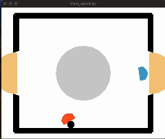

# AI Project: Air Hockey Reinforcement Learning

## Introduction

Air Hockey, implemented within the OpenAI gym, presents itself as a seemingly simple two-player hockey game. However, beneath its surface lie intricate challenges that highlight the significance of reinforcement learning in developing optimal strategies.

Our trained reinforcement learning agents outperform the basic algorithmic opponent provided by the environment, underscoring the necessity and effectiveness of reinforcement learning in surpassing predefined opponents.

We explore solutions for both discrete and continuous action spaces, employing algorithms such as Deep Deterministic Policy Gradient (DDPG). This README provides a brief overview, and for a more in-depth understanding and access to the code implementation, refer to our GitHub repository.

## Algorithms Implemented

### 1. Deep Deterministic Policy Gradient (DDPG)

In our reinforcement learning scenario, the agent interacts with the environment in discrete time steps. The goal is to learn a policy that maximizes the expected return from this distribution.

#### Key Features:

- **Replay Buffer:** Enhances scalability by introducing a replay buffer.
- **Target Network:** Incorporates a separate target network for calculating target values (\(y_t\)).

#### Actor-Critic Approach:

- **Actor Function :** Defines the current policy by deterministically mapping states to specific actions.
- **Critic :** Trained using the Bellman equation.

#### Training Details:

- 30 gradient steps per episode with a batch size of 128.
- Experience replay breaks temporal correlations, promoting data efficiency.

## Usage

To run the code and explore the implementation, follow these steps:

1. Clone the repository: `git clone https://github.com/your-username/your-repo.git`
2. Install dependencies: `pip install git+https://github.com/antic11d/laser-hockey-env.git`
3. Run the main script: `python ./train_agent.py`

For additional details and customization options, refer to the documentation in the repository.
